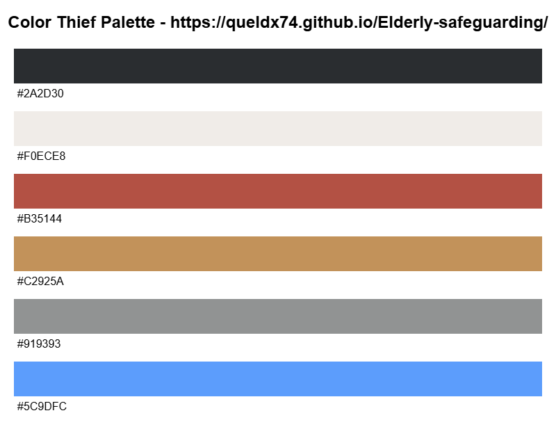


# Elderly Safeguarding

A project dedicated to improving the safety, well-being, and protection of elderly individuals through practical tools, resources, and workflows.

## Overview
Elderly Safeguarding focuses on identifying risks, supporting early intervention, and enabling better care coordination.  
This repository contains the code, documentation, and supporting materials for the project.

## Goals
- Help detect and reduce safeguarding risks
- Improve communication between caregivers and stakeholders
- Provide clear, auditable safeguarding workflows
- Promote privacy-conscious handling of sensitive information

## Features
- Responsive Bootstrap navigation
- Quick Exit button
- Hero section with call-to-action buttons
- Information about adult safeguarding
- Types of abuse cards
- Warning signs section
- Help and emergency contact section
- Safeguarding concern form
- Links to trusted organisations
- Responsive design for mobile, tablet and desktop

## Project Structure
assets/
assets/css/
assets/images/
index.html
README.md

## Technologies used
- HTML5
- CSS3
- Bootstrap 5.3
- Google Fonts
- Git
- GitHub
- GitHub Pages

## Overview

## Fonts

## Running the project
Clone the repository:
git clone https://github.com/queldx74/Elderly-safeguarding.git
Open index.html in your browser
or
Run python3 -m http.server and visit
http://localhost:8000

## Contributing
Contributions are welcome.

1. Fork the repository
2. Create a feature branch  
   `git checkout -b feature/short-description`
3. Commit your changes  
   `git commit -m "Add: short description"`
4. Push to your branch  
   `git push origin feature/short-description`
5. Open a Pull Request
Please open an issue first for major changes.

## Responsive Design
website adapts to:
Mobile
Tablet
Desktop

## Accessibility
Semantic headings
Image alt text
Form labels
Accessible navigation toggle
Responsive images

## Credits
Bootstrap
NHS
Age UK
Hourglass
Lighthouse
W3C Validator

## Roadmap
-Future improvements:
Add a working contact form
Add local authority search
Improve accessibility
Add more safeguarding guidance
Add multilingual support

## wireframe

## AI generated image

## Testing
Test HTML checker
https://validator.w3.org/

Test CSS checker
https://jigsaw.w3.org/css-validator/

Tested on lighthouse metrics
https://lighthouse-metrics.com/lighthouse/checks/8fc8ede7-e1b9-4b55-9988-a0cd293a4a20

Tested on Page Speed Insight Desktop
https://pagespeed.web.dev/analysis/https-queldx74-github-io-Elderly-safeguarding/pisgl52tuc?form_factor=desktop

Tested on Page Speed Insight Mobile

Use of Adobe Express Colour contrast checker. This online tool checks the foreground and background color contrast ratios against WCAG 2.1 accessibility guidelines. Test combinations for AA and AAA standards to help ensure readable, accessible design.​

## Brief description of user value of the components

The navigation, quick exit, get help now, read guide were made and styled in bootstrap. The HTML code was done in Visual Studio Code and later pushed to Github. 
* quick exit button: This layout allows the visitor whos domestic situation is not safe to quickly exit this website and move to a neutral website.  
* The bright red colour of the quick exit button allows a for a user to easier spot it on the website.
* The resource button allows the user to go instantly to the 4 external resources.
* the contact button gives the user the option to go directly to the contact form.

  

This section supplies the main content in regard the different kinds of abuse and the legal base to act on it. The whole section was done in HTML, Bootstrap and CSS and deployed through Github.

This section contains the tools for immediate help for the visitor. The red button would allow in the future to click the button and call emergency services. The button is coloured in red, so it stands out in the sea of white back ground and black coloured font. Above the button are the emergency- and non-emergency numbers listed. On the right if a user or a victim has a concern about a potential safeguarding issue, they can (in the future) contact the appropriate safeguarding officer who can make an judgement of the current situation based on the contact form. Sending and retrieving information requires Javascript and that is an option that can included later in the website. The contact form requires a user to fill something in or else the input will be rejected. The tools used for building this section were Github, HTML, CSS, Bootstrap and VS Code.

This part of the website allows the visitor to contact key organisastions and resources which are vital in protecting elderly adults. Each click on a button leads the visitor to exit the current page and goes to a new tab. In this way the user can always go back to their previous tab containing this website. This prevents to force the visitor to use the backspace button on the browser. There are links to the most popular social media links. At the bottom is a footnote and disclaimer. In the future the links just about the copyright could be made active. 

For the whole of the website I used HTML, CSS, VS Code, Github. Furthermore, I used Bootstrap's responsive grid system (container, row, col-*) to organise the page layout and cards. In addition,  I used Bootstrap Flexbox utilities such as d-flex, justify-content-between, justify-content-end, and align-items-center to align navigation items and buttons. On top of that I used an assorment of AI tools to check my website for errors such as, mentioned in section Testing. 

## The leverage of AI tools in enhancing the software development process
For the completion of the wireframe structure of the website I used the website: https://.uxpilot.ai, because this website has a built in AI tool that users can use to build a wireframe structure for their websites. 
In the use of most of my CSS I used Bootstraps's responsive grid system and their Flexbox system (this was in addition to the use of vanilla CSS). 

## Contact

Project maintainer: **@queldx74**  
Repository: https://github.com/queldx74/Elderly-safeguarding
